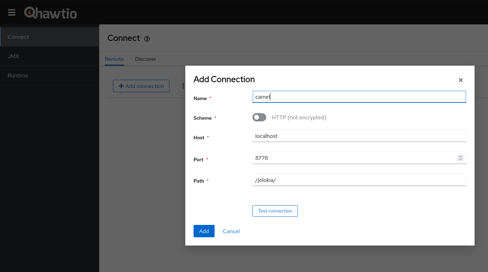
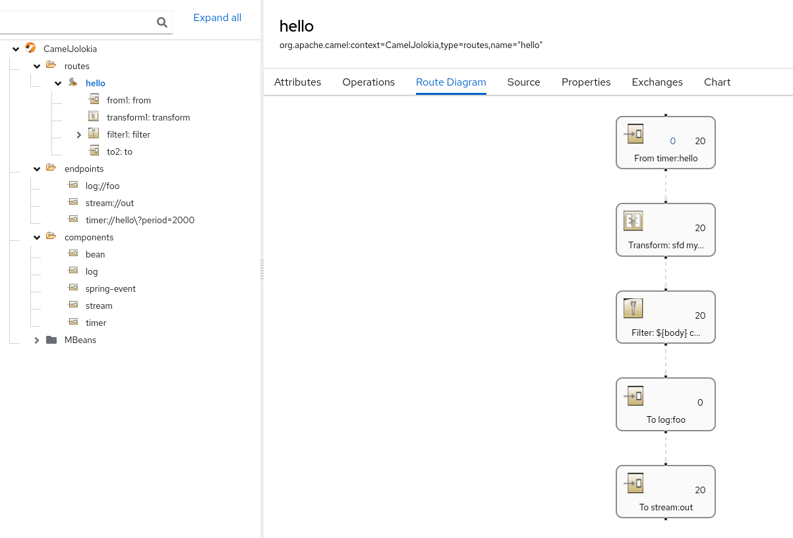

== Jolokia - Spring Boot example

=== Abstract

This example shows how Camel can be monitored and managed using https://jolokia.org[Jolokia] and https://hawt.io[Hawtio]

=== Introduction

=== How to run

You can run this example using

    mvn spring-boot:run

=== Run Hawtio

Hawtio is a lightweight and modular Web console for managing Java applications.
It can be installed/used in more ways, see https://hawt.io/docs/get-started.html[Get Started Guide]

In the example I am suggesting the jbang way to install it

    jbang app install hawtio@hawtio/hawtio
    hawtio --port 8090

=== Connect to the application

Open Hawtio UI at http://localhost:8090/hawtio/connect/remote[] and click on `Add connection` button filling the properties as in the picture

- Name: `as you prefer [eg camel]`
- Scheme: `http`
- Host: `localhost`
- Port: `8778`
- Path: `/jolokia/`

click on `Add` button, this action will create a connection in the list of the connections,
then connect on it clicking on the button `Connect`

then it is possible to monitor and to manage routes

=== Configure Jolokia endpoint

The Jolokia autoconfiguration is an alternative to the Jolokia agent,
more information about the usage and the configuration can be found on https://github.com/apache/camel-spring-boot/blob/main/components-starter/camel-jolokia-starter/src/main/docs/jolokia.adoc[component guide]

=== Run Jolokia HTTPS on a FIPS-enabled RHEL host

Jolokia versions affected by https://redhat.atlassian.net/browse/CSB-11240[CSB-11240]
cannot create their fallback self-signed certificate on a RHEL FIPS host, because that path requests
the unavailable `SHA1PRNG` random-number generator. A practical workaround is to supply the server
certificate and private key explicitly.

Set the paths to a PEM certificate and its matching RSA private key. In a container deployment,
these would normally be paths to files mounted from a TLS Secret:

    export JOLOKIA_SERVER_CERT=/etc/jolokia/tls/tls.crt
    export JOLOKIA_SERVER_KEY=/etc/jolokia/tls/tls.key

Start the application with the `fips-workaround` profile:

    mvn spring-boot:run -Dspring-boot.run.profiles=fips-workaround

The profile configures the following Jolokia options:

    camel.component.jolokia.serverConfig.protocol=https
    camel.component.jolokia.serverConfig.serverCert=${JOLOKIA_SERVER_CERT}
    camel.component.jolokia.serverConfig.serverKey=${JOLOKIA_SERVER_KEY}
    camel.component.jolokia.serverConfig.serverKeyAlgorithm=RSA

With both `serverCert` and `serverKey` present, Jolokia loads the supplied key material and does not
enter its self-signed-certificate generation path. The certificate and key must be generated with
algorithms permitted by the active FIPS provider.

=== How to run on OpenShift cluster

1. create openshift project:

    oc new-project camel-jolokia

2. install Hawtio operator in the camel-jolokia namespace according to the documentation
 https://docs.redhat.com/en/documentation/red_hat_build_of_apache_camel/4.4/html/hawtio_diagnostic_console_guide/setting-up-hawtio-on-openshift-4#installing-and-deploying-hawtio-on-openshift-4-by-using-operatorhub[Installing and deploying HawtIO on OpenShift 4 by using the OperatorHub]

3. create Hawtio instance, default from UI is fine:

    cat <<EOF | oc apply -f -
    apiVersion: hawt.io/v1
    kind: Hawtio
    metadata:
      name: hawtio-online
      namespace: camel-jolokia
    spec:
      resources:
        limits:
          cpu: '1'
          memory: 200Mi
        requests:
          cpu: 200m
          memory: 32Mi
      auth:
        clientCertCheckSchedule: '* */12 * * *'
        clientCertExpirationPeriod: 24
      replicas: 1
      type: Namespace
    EOF

4. deploy application

    mvn clean install -Popenshift

5. access to Hawtio UI console using url

    echo "https://$(oc get route hawtio-online -o go-template --template='{{.spec.host}}')/online/discover"

6. The application `camel-example-spring-boot-jolokia` should be available to the connection
using the `Connect` button. Please refer to the guide
https://docs.redhat.com/en/documentation/red_hat_build_of_apache_camel/4.4/html/hawtio_diagnostic_console_guide/viewing-and-managing-apache-camel-applications#starting_suspending_or_deleting_a_context[Viewing and managing Apache Camel applications]
for additional details

=== Help and contributions

If you hit any problem using Camel or have some feedback, then please
https://camel.apache.org/community/support/[let us know].

We also love contributors, so
https://camel.apache.org/community/contributing/[get involved] :-)

The Camel riders!
